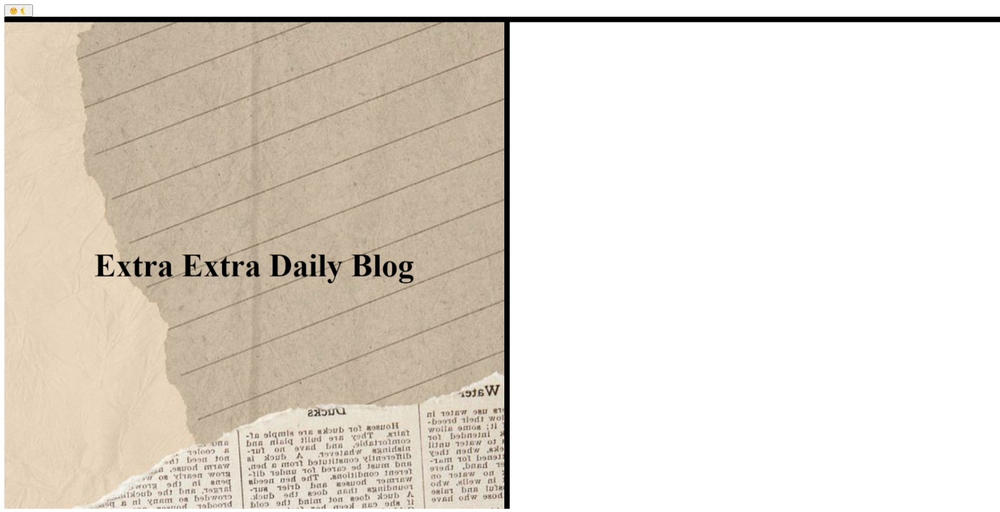

# Extra-Extra-Daily-Blog

## Description

    This Webpage is a creation of my first blog post based on the old times news paper. The webpage is created by html and javascript to accoplish the input of inforamtion and the CSS is to style it in my view. The function of this webpage to make it easy for people to write down thier emotion sanf their toughts. Even thou the webpage doesn't show to be responding correctly I will be providing more code and styling more in the future to accompplish the design I had in my mind. The comprehension of the webpage was to show the involments of how javascript can affect the end result of the webapge as well as how I can design a webpage.

## Table of contents

    N/A

## Instalation 

    The Url will be posted in the usage title page and as well as it will be provided in my git hub account url posted in the repository to be able to interect with.

## Usage

    

## Credits
    
    Thank you to Xpert Learner for provoding code in which I can modify to the specific content involving the webpage.

## License

    The las section of a high-quality README file is the license. The lets other developers know what they can and cannot do with your projec. If you need help choosing a license, refer to https://choosealicense.com/. 

## Badges

    N/A

## Feature

    N/A

## How to Contribute

    N/A

## Test

    N/A
